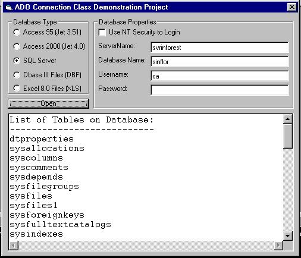



## Connection String Maker \(updated\)

### Description

The purpose of this class is make easy to generate ConnectionStrings to open ADO databases.

Just setting some parameters you can easy open Access MDB with or without password, SQL server using username and password or Windows NT login, DBase III files, Excel Worksheets, Oracle and ODBC. Plus, with a minimum of modification you can easily add support to any other database.

Of course that you always can hardcode your connections strings but this class will make this for you on a very friendly way.

I'm updated with minor changed and translation of comments to english.

Since it's my first submission to planet source code will be glad if I have some feedback positive or negative.

I hope that this class can be so useful for you as it is for me. :)
 
### More Info
 
Returns an ConnectionString that you can use to open any ADO database. Or you can also use the built-in class method to open the database

             |
---                |---
**Submitted On**   |2001-02-15 12:04:10
**By**             |[Matheus Moreira](https://github.com/Planet-Source-Code/PSCIndex/blob/master/ByAuthor/matheus-moreira.md)
**Level**          |Beginner
**User Rating**    |4.7 (94 globes from 20 users)
**Compatibility**  |VB 4\.0 \(32\-bit\), VB 5\.0, VB 6\.0
**Category**       |[Databases/ Data Access/ DAO/ ADO](https://github.com/Planet-Source-Code/PSCIndex/blob/master/ByCategory/databases-data-access-dao-ado__1-6.md)
**World**          |[Visual Basic](https://github.com/Planet-Source-Code/PSCIndex/blob/master/ByWorld/visual-basic.md)
**Archive File**   |[CODE\_UPLOAD149972152001\.zip](https://github.com/Planet-Source-Code/matheus-moreira-connection-string-maker-updated__1-14538/archive/master.zip)

